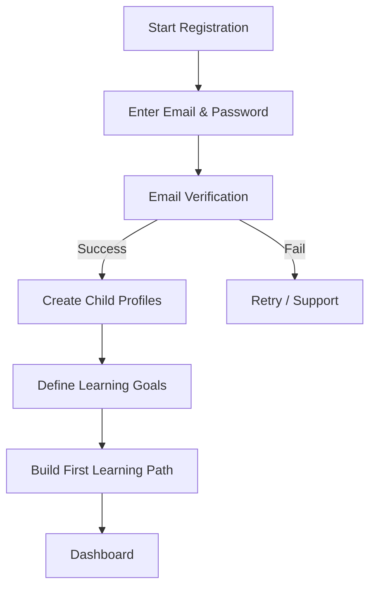
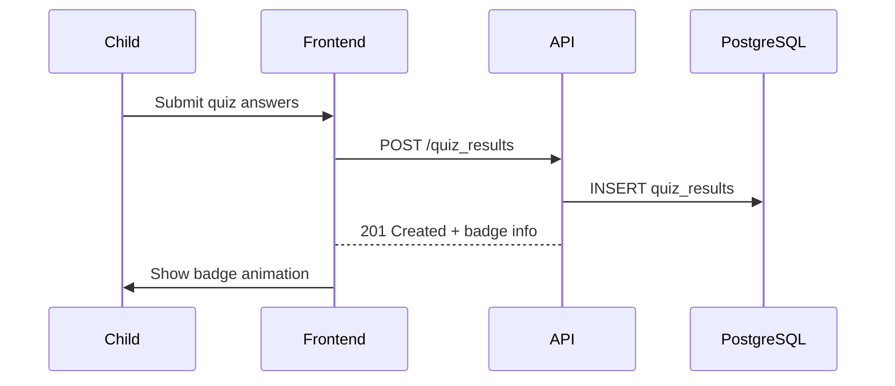

# EduKidHub – Software Requirements Specification (SRS)

## 1. Introduction

### 1.1 Purpose
This Software Requirements Specification (SRS) defines the functional and non-functional requirements for **EduKidHub**, a web application that empowers parents to create personalised learning experiences for children aged 3–12. The document is intended for product managers, designers, architects, developers, testers, and stakeholders who will design, build, test, deploy, and maintain the system.

### 1.2 Scope
EduKidHub will deliver:
1. Parent and child account management with secure authentication.
2. Personalised learning paths composed of curated interactive content.
3. Real-time progress tracking and analytics for parents.
4. A gamified learning experience for children.
5. Cloud-native scalability, high availability, and strong data-privacy compliance (COPPA, GDPR).

### 1.3 Definitions, Acronyms & Abbreviations
| Term | Definition |
|------|------------|
| **MVP** | Minimum Viable Product (Phase 1) |
| **COPPA** | Children’s Online Privacy Protection Act |
| **GDPR** | General Data Protection Regulation |
| **UI** | User Interface |
| **API** | Application Programming Interface |
| **JWT** | JSON Web Token used for stateless authentication |
| **ERD** | Entity-Relationship Diagram |

### 1.4 References
1. EduKidHub Product Requirements Document v1.0 (July 26 2025)
2. ISO/IEC/IEEE 29148:2018 – Systems and software engineering — Life-cycle processes — Requirements engineering
3. WCAG 2.1 Accessibility Guidelines

### 1.5 Overview
Section 2 gives an overall description of the product. Section 3 enumerates detailed system features and functional requirements. Section 4 covers external interfaces. Section 5 lists non-functional requirements. Section 6 describes the database schema. Section 7 provides models (flowcharts, use-case, sequence). Section 8 lists appendices.

---

## 2. Overall Description

### 2.1 Product Perspective
EduKidHub is a new, standalone SaaS platform with React.js frontend, Node.js + Express backend, PostgreSQL (relational data) and MongoDB (content repository), deployed on AWS with auto-scaling and CDN distribution.

### 2.2 Product Functions
* Account creation & authentication (email/password, child PIN/QR).
* Multi-child profile management.
* Content library browsing & recommendation engine.
* Learning path builder (drag-and-drop curriculum).
* Interactive content delivery (video, quizzes, games).
* Progress dashboards & reports for parents.
* Achievement & reward system for children.
* Subscription & payment processing.

### 2.3 User Classes and Characteristics
| User Class | Description | Technical Skill |
|------------|-------------|-----------------|
| Parent | Primary decision-maker, manages subscription, monitors progress | Moderate |
| Child | Learner aged 3–12, interacts with gamified content | Low |
| Admin | Internal staff managing content, users, and reports | High |

### 2.4 Operating Environment
* Web browsers: Latest Chrome, Firefox, Safari, Edge.
* Screen sizes: 320 px mobile → 1920 px desktop.
* Backend hosted on AWS (EC2/ECS + RDS + MongoDB Atlas + CloudFront).

### 2.5 Design & Implementation Constraints
* Must comply with COPPA & GDPR.
* Use PostgreSQL 15+ and MongoDB 6+.
* Payment via Stripe (PCI compliance offloaded).
* Codebase in TypeScript (frontend & backend).

### 2.6 Assumptions & Dependencies
* Reliable internet connection during interactive content playback.
* Parents have valid email and payment method.
* Child devices support modern HTML5 features.

---

## 3. System Features & Functional Requirements

The following subsections list system features. Each functional requirement is labelled **FR-X.Y.Z** where *X* = feature, *Y* = subcategory, *Z* = sequence.

### 3.1 User Management & Authentication

#### 3.1.1 Parent Account
| ID | Requirement |
|----|-------------|
| FR-1.1.1 | The system SHALL allow parents to register using email and password with email verification. |
| FR-1.1.2 | The system SHALL encrypt passwords using bcrypt (cost ≥ 12). |
| FR-1.1.3 | The system SHALL issue JWTs (access & refresh) upon successful login. |
| FR-1.1.4 | The system SHALL allow a parent to create up to 4 child profiles in MVP. |
| FR-1.1.5 | The system SHALL provide role-based dashboards (parent vs. admin). |

#### 3.1.2 Child Access
| ID | Requirement |
|----|-------------|
| FR-1.2.1 | The system SHALL generate a unique 6-digit PIN for each child profile. |
| FR-1.2.2 | The system SHALL support QR code login links valid for 5 minutes. |
| FR-1.2.3 | The child interface SHALL restrict navigation to allowed content only. |
| FR-1.2.4 | The system SHALL require parental approval to modify child profile settings. |

### 3.2 Learning Path Creation & Management

| ID | Requirement |
|----|-------------|
| FR-2.1.1 | The system SHALL display a curated content library grouped by subject & age. |
| FR-2.1.2 | The system SHALL provide a drag-and-drop UI to build learning paths. |
| FR-2.1.3 | The Personalisation Engine SHALL recommend content based on age, interests, and previous performance. |
| FR-2.1.4 | Parents SHALL be able to set milestones with due dates in a learning path. |
| FR-2.1.5 | The system SHALL auto-adjust difficulty level when quiz performance is < 70 % or > 90 %. |

### 3.3 Interactive Learning Experience

| ID | Requirement |
|----|-------------|
| FR-3.1.1 | The system SHALL stream video lessons with adaptive bitrate (HLS). |
| FR-3.1.2 | The system SHALL record quiz answers client-side and sync within 2 s. |
| FR-3.1.3 | The system SHALL award badges for completing milestones. |
| FR-3.1.4 | The reward system SHALL trigger confetti animation and sound on achievement unlock. |

### 3.4 Progress Tracking & Analytics

| ID | Requirement |
|----|-------------|
| FR-4.1.1 | The system SHALL log every learning activity with timestamp, duration, and outcome. |
| FR-4.1.2 | The parent dashboard SHALL visualise subject-wise performance using charts. |
| FR-4.1.3 | The system SHALL email weekly summary reports to parents every Monday 08:00 UTC. |
| FR-4.1.4 | The analytics engine SHALL recommend next-step content when a child completes ≥ 80 % of current path. |

### 3.5 Subscription & Payment (Stripe)
| ID | Requirement |
|----|-------------|
| FR-5.1.1 | The system SHALL integrate Stripe Checkout for subscription plans. |
| FR-5.1.2 | The system SHALL support monthly and annual plans with coupon codes. |
| FR-5.1.3 | The system SHALL allow parents to cancel or upgrade plans via billing portal. |

---

## 4. External Interface Requirements

### 4.1 User Interfaces
* **Parent Dashboard** – Responsive SPA (React) with analytics widgets, learning path editor, billing.
* **Child Portal** – Full-screen minimal UI with large buttons, audio prompts, and gamification.
* **Admin Console** – Role-protected UI for content management and user administration.

### 4.2 APIs (Software Interfaces)
* RESTful JSON API served over HTTPS.
* GraphQL (future phase) for flexible data queries.
* WebSocket channel for real-time notifications (badge unlocked, session timeout).

### 4.3 Data Interfaces
* PostgreSQL accessed via Prisma ORM.
* MongoDB accessed via Mongoose ODM.
* CDN (CloudFront) for static/video asset delivery.

### 4.4 Communications Interfaces
* Email via SendGrid API.
* Push notifications (Phase 3 mobile app).

---

## 5. Non-Functional Requirements

| ID | Category | Requirement |
|----|----------|-------------|
| NFR-1 | Performance | Page load time < 3 s on 5 Mbps connection. |
| NFR-2 | Scalability | Support 10 k concurrent users; auto-scale containers on CPU > 70 %. |
| NFR-3 | Availability | 99.9 % uptime outside scheduled maintenance. |
| NFR-4 | Security | All data in transit encrypted via TLS 1.3; passwords hashed with bcrypt; OWASP Top 10 mitigations. |
| NFR-5 | Privacy | COPPA & GDPR compliance with parental consent workflows. |
| NFR-6 | Accessibility | UI complies with WCAG 2.1 AA. |
| NFR-7 | Maintainability | Codebase documented with typed schemas and 80 % unit-test coverage. |
| NFR-8 | Localization | Support en-US initially; extendable to i18n via i18next. |

---

## 6. Database Design

### 6.1 Entity-Relationship Diagram
```mermaid
erDiagram
    USERS ||--o{ CHILD_PROFILES : owns
    USERS ||--o{ SUBSCRIPTIONS : "subscribes"
    USERS ||--o{ PAYMENTS : "makes"

    CHILD_PROFILES ||--o{ LEARNING_PATHS : "has"
    LEARNING_PATHS ||--o{ PATH_MILESTONES : "contains"
    LEARNING_PATHS ||--o{ CONTENT_ASSIGNMENTS : "uses"

    CONTENT_ITEMS ||--o{ CONTENT_ASSIGNMENTS : "assigned to"
    CHILD_PROFILES ||--o{ PROGRESS_LOGS : "generates"
    CONTENT_ITEMS ||--o{ QUIZZES : "includes"
    QUIZZES ||--o{ QUIZ_RESULTS : "produces"

    USERS {
        uuid id PK
        varchar email UNIQUE
        varchar password_hash
        varchar role
        timestamp created_at
    }
    CHILD_PROFILES {
        uuid id PK
        uuid parent_id FK
        varchar name
        date dob
        int age_cached
        varchar avatar_url
        varchar pin_hash
    }
    CONTENT_ITEMS {
        uuid id PK
        varchar title
        varchar subject
        int age_min
        int age_max
        jsonb metadata
    }
```

### 6.2 Relational Tables (PostgreSQL)

#### `users`
| Field | Type | Constraints |
|-------|------|-------------|
| id | UUID | PK |
| email | VARCHAR(255) | UNIQUE, NOT NULL |
| password_hash | VARCHAR(255) | NOT NULL |
| role | VARCHAR(20) | CHECK (role IN ('parent','admin')) |
| created_at | TIMESTAMP | DEFAULT now() |

#### `child_profiles`
| Field | Type | Constraints |
|-------|------|-------------|
| id | UUID | PK |
| parent_id | UUID | FK → users(id) ON DELETE CASCADE |
| name | VARCHAR(100) | NOT NULL |
| dob | DATE | NOT NULL |
| age_cached | INT | generated column (years from dob) |
| avatar_url | VARCHAR(255) | NULL |
| pin_hash | CHAR(60) | bcrypt |

#### `learning_paths`
| Field | Type | Constraints |
|-------|------|-------------|
| id | UUID | PK |
| child_id | UUID | FK → child_profiles(id) ON DELETE CASCADE |
| title | VARCHAR(255) | NOT NULL |
| status | VARCHAR(20) | ENUM('active','completed','archived') |
| created_at | TIMESTAMP | DEFAULT now() |

#### `path_milestones`
| Field | Type | Constraints |
|-------|------|-------------|
| id | UUID | PK |
| path_id | UUID | FK → learning_paths(id) |
| title | VARCHAR(255) | NOT NULL |
| due_date | DATE | NULL |
| order_index | INT | NOT NULL |

#### `content_items` (MongoDB collection)
* `_id` – ObjectId
* `title`, `subject`, `ageRange`, `type` ('video','quiz','game'), `url`, `metadata` (JSON).

#### `content_assignments`
| Field | Type | Constraints |
|-------|------|-------------|
| id | UUID | PK |
| path_id | UUID | FK → learning_paths(id) |
| content_id | UUID | References content_items._id |
| order_index | INT | NOT NULL |

#### `progress_logs`
| Field | Type | Constraints |
|-------|------|-------------|
| id | UUID | PK |
| child_id | UUID | FK → child_profiles(id) |
| content_id | UUID | REFERENCES content_items._id |
| status | VARCHAR(15) | ENUM('not_started','in_progress','completed') |
| score | INT | NULL |
| duration_sec | INT | NULL |
| created_at | TIMESTAMP | DEFAULT now() |

#### `subscriptions` & `payments`
Standard Stripe schema sync via webhooks (customer_id, plan, status, amount, currency, period).

### 6.3 Indexing Strategy
* `progress_logs` (child_id, created_at DESC).
* `content_items` full-text index on title and metadata.
* Partition `progress_logs` by month when volume > 10 M rows.

---

## 7. System Models

### 7.1 Parent On-boarding Flow


### 7.2 Child Learning Session Flow
```mermaid
flowchart TD
    L1[Child Login (PIN/QR)] --> L2[Personalised Dashboard]
    L2 --> L3{Select Activity}
    L3 -->|Video| V[Play Video]
    L3 -->|Quiz| Q[Take Quiz]
    L3 -->|Game| G[Play Game]
    V --> L4[Completion]
    Q --> L4
    G --> L4
    L4 --> L5[Reward & Badge]
    L5 --> L6[Logout]
```

### 7.3 High-Level Component Diagram
```mermaid
graph LR
    subgraph Frontend (React)
        P[Parent UI] --REST/WebSocket--> API
        C[Child UI] --REST/WebSocket--> API
    end
    subgraph Backend (Node.js/Express)
        API[REST & WS API]
        Auth[Auth Service]
        Path[Learning Path Service]
        Content[Content Service]
        Analytics[Analytics Service]
        Billing[Billing Service]
    end
    API --> Auth
    API --> Path
    API --> Content
    API --> Analytics
    API --> Billing
    Auth --> PG[(PostgreSQL)]
    Path --> PG
    Analytics --> PG
    Content --> MDB[(MongoDB)]
    Billing --> Stripe[(Stripe)]
    CDN[(CloudFront)] --delivers--> C
    CDN --delivers--> P
```

### 7.4 Sequence Diagram – Quiz Submission


---

## 8. Appendices
* **A. Compliance Checklist** – COPPA, GDPR articles mapping.
* **B. API Endpoint List** – documented in OpenAPI 3.0 (separate file).
* **C. Content Taxonomy** – subject codes and metadata schema.

---

### Revision History
| Version | Date | Author | Notes |
|---------|------|--------|-------|
| 0.1 | 2025-07-26 | Solution Architect | Initial draft derived from PRD | 